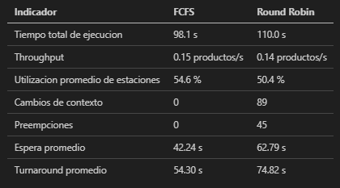

[//]: # 'mdpdf -o INFORME.pdf --header "Anthony Barrantes Jimenez, IC6600, Samir Cabrera Tabash" --footer "{date},{heading},{page}" INFORME.md'

# Informe de la Solucion

## 1. Introduccion

Este informe documenta la simulacion de una linea de produccion discreta desarrollada en C. El sistema modela tres estaciones de trabajo (corte, ensamblaje y empaque) coordinadas por un planificador que puede operar en modo First Come First Serve (FCFS) o Round Robin (RR). Se describe el flujo de la solucion paso a paso, se justifican las decisiones tecnicas y se analizan los resultados obtenidos con ambos algoritmos usando la evidencia registrada en `simulador.log` y `results.log`.

## 2. Descripcion de la solucion

### 2.1 Flujo general de la simulacion

1. **Inicializacion de subsistemas**: `main.c` activa el registrador (`metrics/logger.c`) y el agregador de metricas (`metrics/metrics.c`). Esta fase establece mutex y estructuras de tiempo base para toda la ejecucion.
2. **Construccion de infraestructura de comunicacion**: se crean cuatro colas (`core/queue.c`) que actuan como buffers thread-safe entre etapas (cola de entrada, dos colas intermedias y cola de salida).
3. **Instanciacion de estaciones**: cada estacion (`core/station.c`) se configura con su cola de entrada, salida y un posible valor de varianza. Se enlazan formando una cadena (Chain of Responsibility) para que un producto pueda atravesar la linea en orden.
4. **Lanzamiento de hilos**: `station_start_thread` crea un hilo POSIX por estacion que realiza el ciclo de trabajo: tomar producto de la cola, procesarlo durante el tiempo configurado y encolar el resultado para la siguiente etapa.
5. **Creacion de productos**: el modulo `patterns/factory.c` genera un lote de productos (`core/product.c`) con identificadores consecutivos y estructuras de metricas asociadas.
6. **Arranque del scheduler**: `core/scheduler.c` se ejecuta como hilo dedicado. Recibe productos listos, aplica el algoritmo seleccionado (FCFS o RR), despacha a la primera estacion y mantiene estadisticas globales.
7. **Monitoreo**: el hilo principal consulta periodicamente la cola de salida para informar progreso y detectar timeouts.
8. **Finalizacion controlada**: al completar el lote, el scheduler y las estaciones reciben senales de parada, se unen los hilos (`pthread_join`) y se liberan recursos.
9. **Captura de metricas**: `metrics_capture_summary` consolida tiempos totales, esperas, cambios de contexto y un subconjunto de productos destacados para generar `results.log`.

### 2.2 Arquitectura de modulos

- **`main.c`**: controla e inicia la simulacion. Define constantes por defecto, interpreta argumentos, configura tiempos de estaciones, invoca la factory y controla el ciclo de vida del scheduler y las estaciones.
- **`patterns/factory.c`**: aplica el patron Factory para crear productos de una manera controlada, homogénea y eficiente. Centraliza la logica de asignacion de memoria y garantiza identificadores unicos.
- **`core/product.[c y h]`**: define la estructura del producto, incluyendo campos para seguimiento de estados y referencias a metricas individuales.
- **`core/queue.[c y h]`**: implementa colas thread-safe mediante mutex y semaforos POSIX. Cada operacion de insercion o extraccion bloquea hasta que existan elementos o espacio, asegurando backpressure en la linea.
- **`core/station.[c y h]`**: encapsula la logica de cada etapa. Cada estacion mantiene su propio hilo, tiempo base de proceso, varianza opcional y un puntero a la siguiente estacion. Coordina pausas y preempciones notificando al scheduler cuando recibe y libera productos.
- **`core/scheduler.[c y h]`**: contiene la estrategia de planificacion. Emplea Strategy Pattern para alternar entre FCFS y RR sin duplicar logica de sincronizacion. Gestiona la cola de listos, despachos, reencolados por preempcion y estadisticas de cambios de contexto.
- **`metrics/logger.[c y h]` y `metrics/metrics.[c y h]`**: proporcionan registro estructurado y consolidacion de datos. El logger serializa mensajes en `simulador.log`, mientras que el agregador mide tiempos de espera, turnaround y uso de estaciones.

### 2.3 Detalle operativo de cada paso

1. **Configuracion de estaciones**: `station_set_processing_variance` permite activar un modo determinista (varianza cero) o aleatorio (varianza proporcional al 25 % del tiempo base). El escenario evaluado utiliza modo determinista, lo que facilita comparar algoritmos sin ruido estocastico.
2. **Gestion de entradas**: `scheduler_add_product` inserta cada producto en la cola de listos y notifica al hilo del scheduler mediante un semaforo (`sem_post`). Asi se evita polling y se minimiza la latencia entre creacion y primer despacho.
3. **Despacho y seguimiento**: al enviar un producto a la estacion de corte, el scheduler registra la hora real de inicio (`scheduler_notify_execution_start`) para asegurar que los tiempos de espera calculados reflejen uso efectivo de CPU y no solo encolados.
4. **Preempcion en Round Robin**: `scheduler_rr_start_quantum` inicia un temporizador por producto. Si expira el quantum y la estacion aun procesa, se marca `preemption_requested`; el hilo de la estacion detecta la bandera, detiene el trabajo al final del microciclo y devuelve el producto a la cola de listos.
5. **Propagacion en la linea**: cuando una estacion termina, `station_push_to_next` inserta el producto en la cola de la siguiente etapa. Si la estacion es la ultima, el producto se envia a la cola de salida, donde el hilo principal puede contabilizarlo.
6. **Captura de metricas finas**: cada producto lleva `product_metrics_t` que almacena tiempos de entrada/salida por estacion, esperas individuales y numero de preempciones. Al finalizar se integran para brindar un informe por algoritmo.
7. **Liberacion de recursos**: se libera primero la memoria de productos en la cola de salida (con mutex para evitar condiciones de carrera), luego se destruyen estaciones, colas y el scheduler, siguiendo el orden inverso de creacion para evitar referencias colgantes.

### 2.4 Manejo de concurrencia y sincronizacion

- **Hilos POSIX (`pthread`)**: cada estacion y el scheduler tienen hilos dedicados, lo que permite superponer procesamiento y planificacion.
- **Mutex y condiciones**: `queue_t` usa `pthread_mutex_t` combinado con `pthread_cond_t` y semaforos para garantizar exclusividad de acceso y señales cuando una cola cambia de estado.
- **Semaforos (`sem_t`)**: el scheduler mantiene un semaforo de disponibilidades que despierta al hilo planificador cuando aparecen productos listos.
- **Estrategia de parada**: banderas atomicas dentro de `station_t` y `scheduler_t` permiten terminar hilos sin interrupciones abruptas.
- **Proteccion de metricas**: operaciones de escritura en `results.log` se serializan con un mutex en el logger para evitar intercalado de mensajes en ambientes multihilo.

### 2.5 Registro y observabilidad

- `simulador.log` contiene mensajes cronologicos para depurar eventos: creacion de estaciones, despachos, preempciones y finalizacion. Las marcas de tiempo permiten reconstruir el orden real de los hechos.
- `results.log` resume el rendimiento de cada algoritmo: tiempos totales, throughput, utilizacion de estaciones y estadisticas por producto. Facilita comparaciones sin reanalizar el log bruto.
- El modulo de metricas tambien exporta productos destacados (primeros tres) para ilustrar como evolucionan los tiempos de espera a medida que la linea se congestiona.

## 3. Justificacion tecnica

### 3.1 Lenguaje y bibliotecas

- **C estandar**: garantiza control explicito sobre memoria y sincronizacion, indispensable para simular condiciones de sistemas operativos y estudiar efectos de planificacion.
- **POSIX Threads y sincronizadores**: el uso de `pthread`, `pthread_mutex`, `pthread_cond` y `sem_t` replica mecanismos reales de un kernel, permitiendo experimentar con politicas sin depender de frameworks externos.
- **`unistd.h` y `time.h`**: proporcionan `sleep` y `clock_gettime`, necesarios para medir tiempos precisos y crear pausas controladas.

### 3.2 Estructuras de datos y patrones

- **Colas enlazadas**: la estructura `queue_t` emplea nodos dinamicos para evitar limites rigidos de tamano y permitir que el sistema se adapte al ritmo del scheduler.
- **Patron Factory**: centraliza la creacion de productos con configuracion uniforme y permite extender la fabrica para nuevos tipos sin modificar el resto del codigo.
- **Strategy Pattern** en `scheduler.c`: separar FCFS y RR en estrategias intercambiables simplifica agregar algoritmos futuros (por ejemplo, SJF) sin alterar el ciclo de control principal.
- **Chain of Responsibility** entre estaciones: cada estacion conoce solo a la siguiente, lo que vuelve flexible reordenar o insertar etapas adicionales.

### 3.3 Medicion y trazabilidad

- Se decidio instrumentar cada estacion y el scheduler con metricas integradas para obtener tiempos de espera y turnaround precisos. Esto permite contrastar efectos de planificacion sin herramientas externas.
- El logger con formato consistente (`[hora] nivel [origen] mensaje`) facilita filtrar eventos, detectar cuellos de botella y correlacionar preempciones con resultados numericos.

### 3.4 Manejo de errores y limpieza

- Cada paso comprueba retornos de funciones criticas (crear hilos, asignar memoria). En caso de fallo, se imprime un mensaje a nivel `SYSTEM_ERROR` y se evita continuar con un estado inconsistente.
- La liberacion ordenada (primero productos, luego estaciones, finalmente scheduler y factory) previene fugas y race conditions al apagar el sistema.

### 3.5 Ajustes clave del proyecto

- **Quantum de Round Robin**: se fijo en 500 ms para ilustrar con claridad el impacto de preempciones frecuentes. Este valor se expone como argumento para permitir experimentacion.
- **Modo determinista por defecto**: elimina variaciones aleatorias en tiempos de estacion, asegurando que los cambios observados se deban al algoritmo y no a ruido estadistico.
- **Numero de productos**: 15 unidades proveen suficiente carga para que se manifiesten tiempos de espera crecientes sin alargar la simulacion en exceso, sin embargo puede ajustarse segun necesidades e interés del usuario.

## 4. Comparacion entre algoritmos

Los resultados siguientes provienen directamente de `results.log` y se corroboran con eventos en `simulador.log` (marcas de tiempo de inicio y fin, mensajes de preempcion y actualizaciones de progreso).

### 4.1 Resumen cuantitativo

### 4.2 Orden y comportamiento observado

- **Orden de finalizacion**: ambos algoritmos entregan los productos en secuencia ascendente (0 a 14). En Round Robin aparecen reencolados recurrentes, observables en `simulador.log` a traves de los mensajes `Quantum expirado`.
- **Progresos reportados**: con FCFS el contador de progreso avanza de forma uniforme cada vez que la estacion de empaque completa una unidad (~4 s entre eventos). En Round Robin los avances son mas irregulares; la primera finalizacion surge alrededor de los 20 s porque los productos alternan turnos antes de completar cada estacion.
- **Tiempos por estacion**: los tiempos efectivos de proceso se mantienen alineados con las configuraciones (≈2, 6 y 4 s). La diferencia entre algoritmos proviene de la espera acumulada entre turnos: en Round Robin cada producto vuelve a la cola tras agotar su quantum y necesita varias rondas para concluir.
- **Eventos destacados**: los mensajes `Quantum expirado` del planificador confirman 45 preempciones totales, las cuales tienen sentido con el quantum y tiempos establecidos (por productos, en estación 1 hay 0 preempciones, en estación 2 hay 2 preempciones y en estación 3 hay 1 preempción; dando así 3 preempciones por producto y, con 15 productos, 45 preempciones en total; este cálculo nos permite asegurar la precisión del sistema en su proceso de ejecución). La seccion Round Robin del log documenta como los productos alternan entre estaciones hasta completar sus fases.

### 4.3 Impacto para perfiles tecnicos

- **Eficiencia**: FCFS mantiene la ventaja en throughput y tiempo total (≈12 s menos), apoyado en la ausencia de cambios de contexto y preempciones, se debe recordar que estas mediciones son para un escenario determinista y con tiempos de proceso relativamente largos. En escenarios con procesos cortos o altamente variables, Round Robin podria reducir latencias y aumentar la eficiencia.
- **Equidad y respuesta**: Round Robin reparte CPU para evitar monopolios, aunque con 500 ms de quantum cada producto requiere multiples turnos por estacion. Esto incrementa el tiempo de espera promedio hasta 62.79 s, claramente superior al observado con FCFS.
- **Uso de recursos**: la utilizacion de estaciones en Round Robin alcanza 50.4 %, muy proxima a la de FCFS. No obstante, el tiempo invertido en suspender y reanudar trabajos sigue inclinando la balanza a favor de FCFS cuando el objetivo es maximizar productividad en un escenario determinista.

### 4.4 Interpretacion para lectores no tecnicos

- Piense en FCFS como una fila unica: cada producto espera su turno completo en cada estacion. El flujo avanza rapido porque no hay interrupciones, pero los ultimos productos esperan mas tiempo antes de comenzar.
- Round Robin funciona como turnos breves y ciclicos. Los relevos introducen demoras adicionales frente a FCFS, por lo que conviene ajustar el quantum si se necesita mayor productividad o aplicar en un escenario donde cada tarea tome un tiempo distinto, aprovechando al máximo el mecanismo del Round Robin.

### 4.5 Conclusiones de la comparacion

- Para la configuracion actual (procesos largos y deterministas), FCFS es la alternativa con menor tiempo de ciclo y menor espera.
- Round Robin puede acercarse a esos resultados si se ajusta el quantum para alinearlo con los tiempos de servicio o se adoptan estrategias adaptativas que limiten las preempciones.
- La simulación permite observar claramente como la eleccion del algoritmo de planificacion impacta en metricas clave, y subraya la importancia de seleccionar politicas acordes al perfil de carga y objetivos del sistema.
